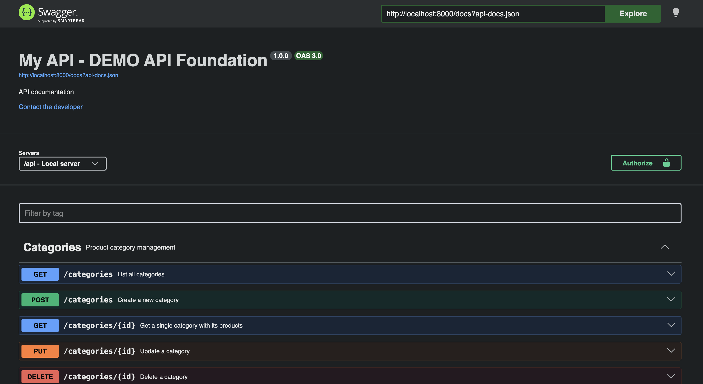

# api-foundation-demo

Demo project showcasing [gabylis/api-foundation](https://github.com/Gabylis/api-foundation) — a Laravel package for building documented REST APIs with structured JSON responses and PHP 8 OpenAPI attributes.

Implements a simple **Products + Categories** catalog API with full CRUD, pagination, filters, and auto-generated Swagger UI documentation.

---

## Live demo

Swagger UI: `http://localhost:8000/api/documentation`



---

## Stack

- **Laravel 11**
- **SQLite** — zero-config database
- **gabylis/api-foundation** — base controller, structured responses, OpenAPI scaffold
- **darkaonline/l5-swagger** — Swagger UI generation from PHP 8 attributes

---

## Endpoints

### Categories

| Method | Path | Description |
|---|---|---|
| GET | `/api/categories` | List all (paginated, with product count) |
| GET | `/api/categories/{id}` | Get single category |
| POST | `/api/categories` | Create |
| PUT | `/api/categories/{id}` | Update |
| DELETE | `/api/categories/{id}` | Soft delete |

### Products

| Method | Path | Description |
|---|---|---|
| GET | `/api/products` | List all (paginated) |
| GET | `/api/products/{id}` | Get single product with category |
| POST | `/api/products` | Create |
| PUT | `/api/products/{id}` | Update |
| DELETE | `/api/products/{id}` | Soft delete |

**Available filters for `GET /api/products`:**
- `?category_id=1` — filter by category
- `?active=true` — filter by active status
- `?search=headphones` — search by name or SKU
- `?per_page=5` — pagination

---

## Quick start

```bash
git clone https://github.com/Gabylis/api-foundation-demo.git
cd api-foundation-demo

composer install

cp .env.example .env
php artisan key:generate

touch database/database.sqlite
php artisan migrate --seed

php artisan l5-swagger:generate
php artisan serve
```

Open **http://localhost:8000/api/documentation**

---

## Example requests

```bash
# List categories
curl http://localhost:8000/api/categories

# List products filtered by category
curl "http://localhost:8000/api/products?category_id=1&per_page=5"

# Search products
curl "http://localhost:8000/api/products?search=electronics"

# Create a category
curl -X POST http://localhost:8000/api/categories \
  -H "Content-Type: application/json" \
  -d '{"name": "Sports", "description": "Sporting goods"}'

# Create a product
curl -X POST http://localhost:8000/api/products \
  -H "Content-Type: application/json" \
  -d '{
    "category_id": 1,
    "name": "Wireless Headphones",
    "sku": "WH-XM5",
    "price": 349.99,
    "stock": 50
  }'
```

---

## Response envelope

Every response follows the same structure provided by `gabylis/api-foundation`:

```json
{
    "success": true,
    "status": "success",
    "message": "Products retrieved successfully",
    "data": [...],
    "meta": {
        "per_page": 15,
        "current_page": 1,
        "total": 20,
        "last_page": 2,
        "next_page_url": "...",
        "previous_page_url": null
    }
}
```

Validation errors always return JSON (never redirects):

```json
{
    "success": false,
    "status": "failed",
    "message": "The name field is required.",
    "data": {
        "name": ["The name field is required."]
    }
}
```

---

## How gabylis/api-foundation is used here

```php
// 1. Controllers extend ApiBaseController
class ProductApiController extends ApiBaseController { ... }

// 2. Paginated response with meta
return $this->sendPaginatedResponse($products, 'Products retrieved', ProductResource::class);

// 3. Single resource response
return $this->sendResponse(new ProductResource($product), 'Product retrieved');

// 4. Error response
return $this->sendError('Product not found', [], 404);

// 5. Success message only
return $this->sendSuccess('Product deleted successfully');

// 6. FormRequest extends ApiFormRequest — always returns JSON
class StoreProductRequest extends ApiFormRequest { ... }
```

---

## Related

- **Package**: [gabylis/api-foundation](https://github.com/Gabylis/api-foundation)
- **Packagist**: [packagist.org/packages/gabylis/api-foundation](https://packagist.org/packages/gabylis/api-foundation)

---

## License

MIT
